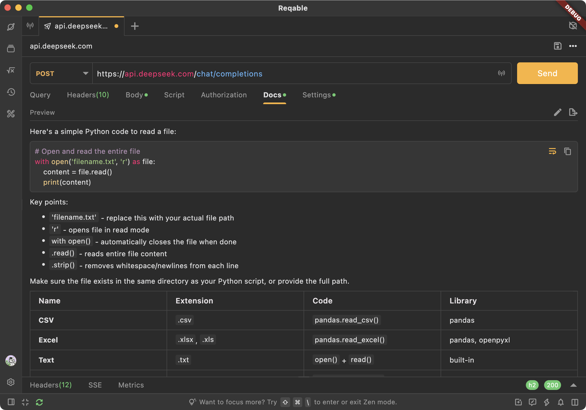

# Re-Markdown

[](https://pub.dev/packages/re_markdown)

`Re-Markdown`是一个轻量级的Markdown预览效果视图，是[Reqable](https://reqable.com)项目中的一个子模块。`Re-Markdown`使用[re-highlight](https://github.com/reqable/re-highlight)作为代码高亮引擎，支持上百种编程语言和代码配色，并支持自定义代码视图、图片视图、链接点击行为等特性。同时，支持AI结果流式显示效果。

**⚠️ 注意：不支持TOC相关功能。**



## 开始使用

添加依赖到 `pubspec.yaml`.

```yaml
dependencies:
  re_markdown: ^0.0.1
```

显示你的Markdown内容：

```dart
Markdown(
  data: "Your markdown content here",
)
```

## 自定义基本样式

可以使用`StyleSheet`来配置你的Markdown视图的每个标签和区块样式。
```dart
StyleSheet(
  a: const TextStyle(color: Colors.blue),
  p: theme.textTheme.bodyMedium,
  pPadding: EdgeInsets.zero,
  code: theme.textTheme.bodyMedium!.copyWith(
    backgroundColor: theme.cardTheme.color ?? theme.cardColor,
    fontFamily: 'monospace',
    fontSize: theme.textTheme.bodyMedium!.fontSize! * 0.85,
  ),
  h1: theme.textTheme.headlineSmall,
  h1Padding: EdgeInsets.zero,
  h2: theme.textTheme.titleLarge,
  h2Padding: EdgeInsets.zero,
  h3: theme.textTheme.titleMedium,
  h3Padding: EdgeInsets.zero,
  h4: theme.textTheme.bodyLarge,
  h4Padding: EdgeInsets.zero,
  h5: theme.textTheme.bodyLarge,
  h5Padding: EdgeInsets.zero,
  h6: theme.textTheme.bodyLarge,
  h6Padding: EdgeInsets.zero,
  em: const TextStyle(fontStyle: FontStyle.italic),
  strong: const TextStyle(fontWeight: FontWeight.bold),
  del: const TextStyle(decoration: TextDecoration.lineThrough),
  blockquote: theme.textTheme.bodyMedium,
  img: theme.textTheme.bodyMedium,
  checkbox: theme.textTheme.bodyMedium!.copyWith(
    color: theme.primaryColor,
  ),
  blockSpacing: 8.0,
  listIndent: 24.0,
  listBullet: theme.textTheme.bodyMedium,
  listBulletPadding: const EdgeInsets.only(right: 4),
  tableHead: const TextStyle(fontWeight: FontWeight.w600),
  tableBody: theme.textTheme.bodyMedium,
  tableHeadAlign: TextAlign.center,
  tableBorder: TableBorder.all(
    color: theme.dividerColor,
  ),
  tableColumnWidth: const FlexColumnWidth(),
  tableCellsPadding: const EdgeInsets.fromLTRB(16, 8, 16, 8),
  tableCellsDecoration: const BoxDecoration(),
  blockquotePadding: const EdgeInsets.all(8.0),
  blockquoteDecoration: BoxDecoration(
    color: Colors.blue.shade100,
    borderRadius: BorderRadius.circular(2.0),
  ),
  codeblockPadding: const EdgeInsets.all(8.0),
  codeblockDecoration: BoxDecoration(
    color: theme.cardTheme.color ?? theme.cardColor,
    borderRadius: BorderRadius.circular(2.0),
  ),
  codePadding: EdgeInsets.zero,
  codeDecoration: BoxDecoration(
    color: theme.cardTheme.color ?? theme.cardColor,
    borderRadius: BorderRadius.circular(2.0),
  ),
  horizontalRuleDecoration: BoxDecoration(
    border: Border(
      top: BorderSide(
        width: 5.0,
        color: theme.dividerColor,
      ),
    ),
  ),
);
```

## 自定义代码块样式

你可以使用`CodeBlockWidgetBuilder`来自定义代码块视图。我们提供了默认实现`DefaultCodeBlockWidgetBuilder`，可以通过参数来配置代码高亮样式，也可以继承并重写`build`函数来实现更多的功能，例如添加换行按钮、复制按钮等等。
```dart
class _CodeBlockWidgetBuilder extends DefaultCodeBlockWidgetBuilder {

  _CodeBlockWidgetBuilder({
    required super.wordWrap,
    required super.theme,
  });

  @override
  Widget build(BuildContext context, CodeBlockNodeData data, StyleSheet styleSheet) {
    return Stack(
      children: [
        super.build(context, data, styleSheet),
        Positioned(
          right: 5,
          top: 5,
          child: Row(
            children: [
              // TODO: add icon buttons
            ],
          )
        )
      ],
    );
  }

}
```

## 自定义图片样式

你可以使用`ImageWidgetBuilder`来自定义图片视图，包括图片加载逻辑、图片失败视图等等。我们提供了默认的实现`DefaultImageWidgetBuilder`，可以自定义图片加载失败的显示视图。如果你需要更高自由度的定制，可以完全实现`ImageWidgetBuilder`的接口。

```dart
class CustomImageWidgetBuilder implements ImageWidgetBuilder {

  @override
  Widget build(BuildContext context, ImageNodeData data, StyleSheet styleSheet) {
    // TODO: Add support for image loading and error handling.
  }

}
```

## 自定义点击行为

默认情况下，我们使用`url_launcher`来打开链接，但是你可以通过实现`LinkActionBuilder`的接口来自定义点击行为。
```dart
class _LinkActionBuilder implements LinkActionBuilder {

  @override
  void onTap(BuildContext context, Uri uri) {
    // TODO: handle your tap event.
  }

}
```

## 内容选中

`Re-Markdown`支持全部内容选中，和其他视图一样，只需要在父布局使用`SelectionArea`即可。
```dart
SelectionArea(
  child: Markdown(
    data: "Your markdown content here",
  )
)
```

## 支持的Markdown语法标签

- blockquote
- ul
- ol
- li
- table
- thead
- tbody
- tr
- th
- td
- hr
- pre
- h1
- h2
- h3
- h4
- h5
- h6
- a
- p
- code
- em
- del
- br
- strong
- img
- input
- comment

## 许可证

MIT License

## 致谢

开发过程中，我们使用或者参考了下面的项目，表示诚挚的谢意。

- [markdown](https://pub.dev/packages/markdown)
- [markdown_widget](https://pub.dev/packages/markdown_widget)

## 赞助

如果本项目对您有帮助，欢迎通过购买[Reqable](https://reqable.com/pricing)的会员来赞助和支持我们。